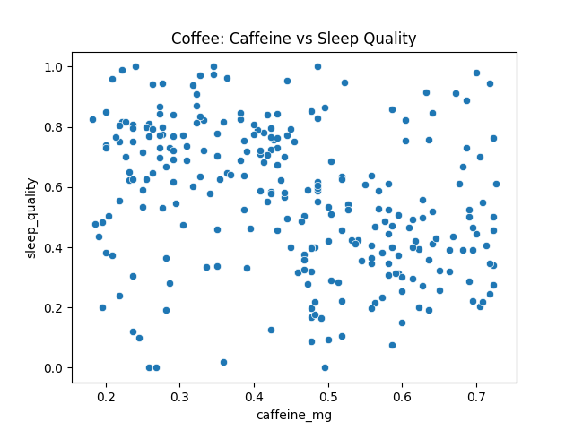
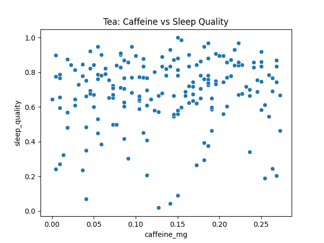

# Štatistická práca - Martin Belluš - Coffeine Effect on Sleep

---

## Korelácia kofeínu a spánku

Ako prvé sa pozriem, či existuje korelácia medzi množstvom skonzumovaného
kofeínu (`caffeine_mg`) a kvalitou spánku (`sleep_quality`). Dáta rozdelím podľa
toho, či sa jedná o kávu alebo čaj.

*Nulová hypotéza*: Neexistuje korelácia medzi množstvom skonzumovaného kofeínu a
kvalitou spánku.

*Alternatívna hypotéza*: Existuje negatívna korelácia medzi množstvom
skonzumovaného kofeínu a kvalitou spánku.

Na testovanie použijem Pearsonov koeficient.

Zdrojový kód testu sa nachádza v súbore [src/correlation.py](./src/correlation.py)

Výsledok testu:

```
Coffee - Testing correlation between caffeine_mg and sleep_quality
Pearson correlation: r = -0.320, p = 5.264505197063971e-08

Tea - Testing correlation between caffeine_mg and sleep_quality
Pearson correlation: r = 0.082, p = 0.8697615652798727
```

Pearsonov koeficient pre čaj je nečakane kladný, preto spravím ešte test pre
alternatívnu hypotézu, že čaj má pozitívnu koreláciu s kvalitou spánku.
Výsledok:

```
Tea Positive - Testing correlation between caffeine_mg and sleep_quality
Pearson correlation: r = 0.082, p = 0.13023843472012667
```

Hodnota p pre kávu je väčšia ako 0.05, preto zamietam nulovú hypotézu. Teda
existuje silná negatívna korelácia medzi množstvom skonzumovaného kofeínu z kávy
a kvalitou spánku.

Pre čaj je hodnota p menšia ako 0.05, preto nulovú hypotézu nemôžem zamietnuť.

Na záver ešte vykreslím grafy kvality spánku v závislosti od množstva kofeínu:




